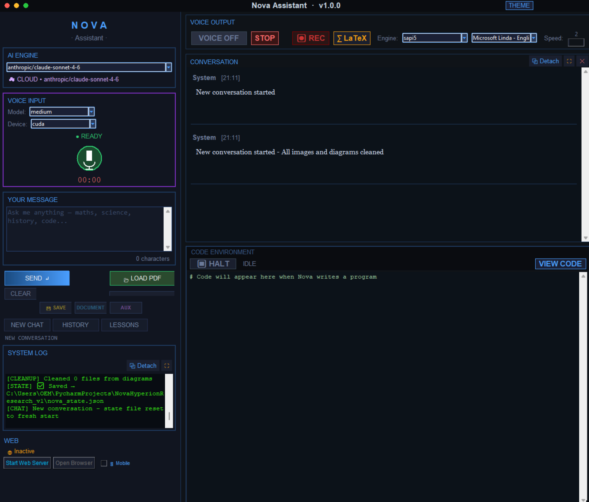
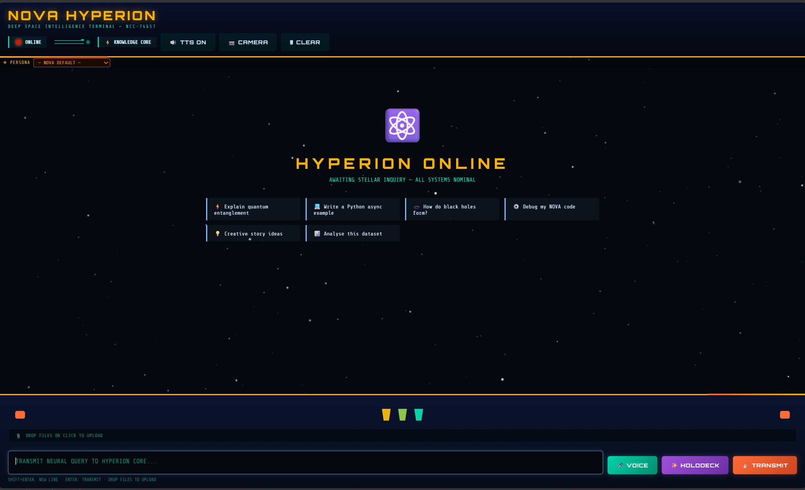
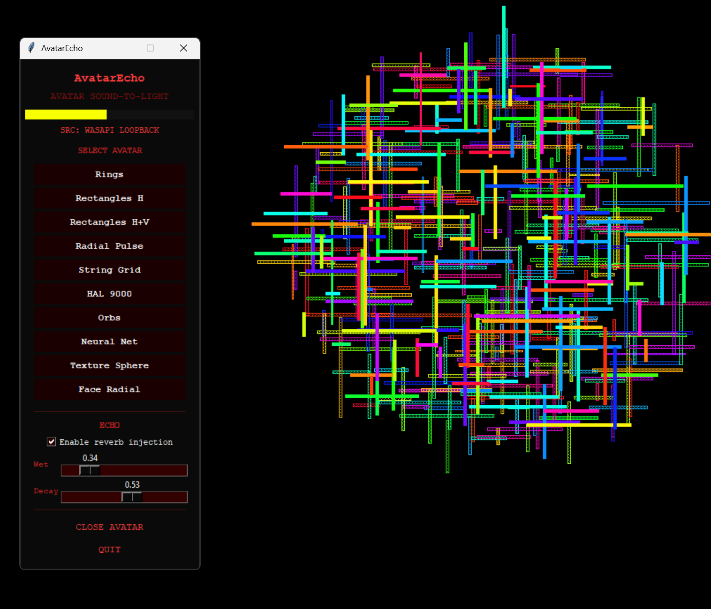
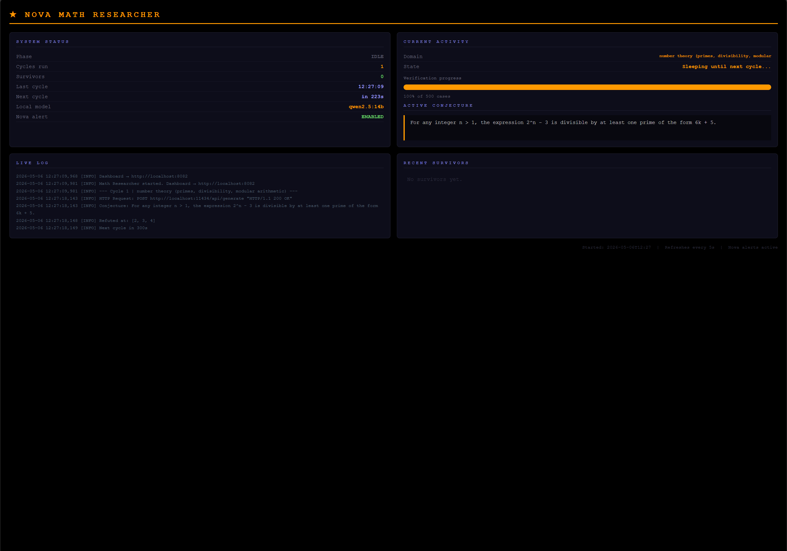
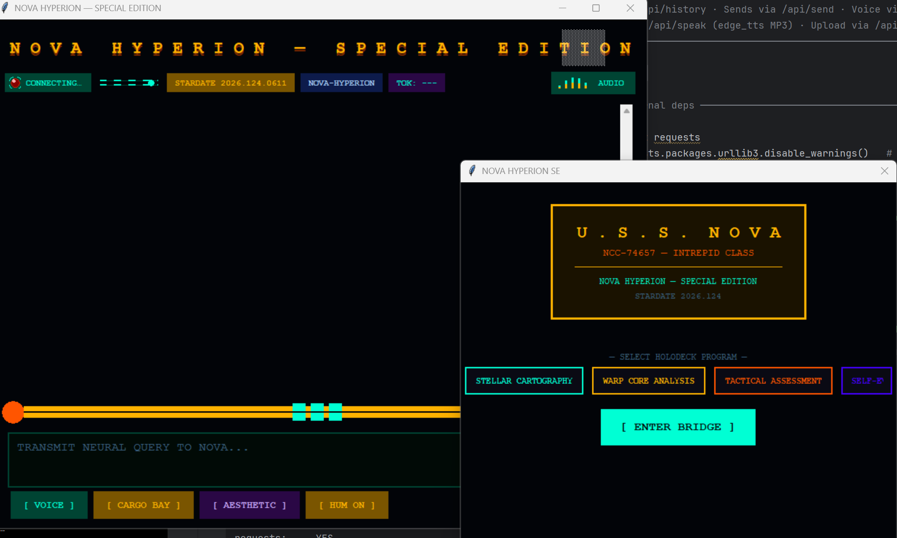
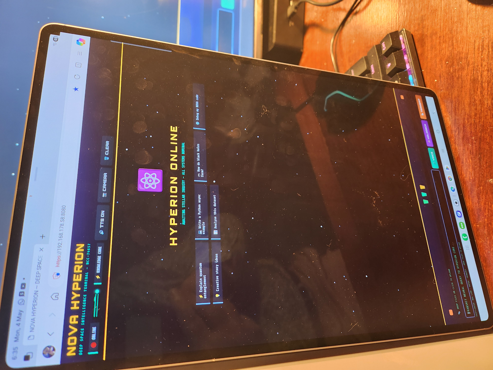
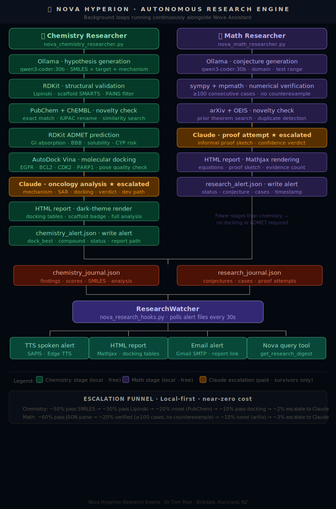

# Nova Hyperion Research
## AI Operating System for Research, Coding, and Autonomous Discovery

**Author:** Dr Tom Moir —  Auckland, New Zealand
**Version:** 1.0.0
**License:** MIT

---

Nova Hyperion is an **AI-powered multimodal desktop system** that combines large language models, autonomous agents, tool execution, code generation, real-time voice interaction, and an autonomous scientific research engine into a unified environment.

This is a serious multi-agent AI that can do hard sums. Make no mistake and do not be put off by its appearance — that is intentional. Everything here is free **except** your OpenRouter tokens if you choose to use web-based models like Claude (recommended). Otherwise you can download and use local Ollama models running on your PC, but you will need a decent NVIDIA graphics card. A 16 GB VRAM card (RTX 5070 Ti) works well. You will also need a free Brave API key. See the Installation section for `.env` details.
<div align="center">

| | | |
|:---:|:---:|:---:|
|  |  |  |
| *NOVA Assistant* | *NOVA Web Interface* | *NOVA Avatar* |
|  |  |  |
| *Research Panel* | *Hyperion Terminal* | *NOVA Mobile* |

</div>
---
---

---
> 🧠 **Nova is an AI Operating System for Research, Coding, and Autonomous Tasks**

---

## Table of Contents

1. [Core Philosophy](#core-philosophy)
2. [Interfaces](#interfaces)
3. [System Architecture](#system-architecture)
4. [Execution Modes](#execution-modes)
5. [Core Components](#core-components)
6. [Tool System](#tool-system)
7. [Memory Architecture](#memory-architecture)
8. [Emotional Affect System](#emotional-affect-system)
9. [Voice Interaction](#voice-interaction)
10. [The Autonomous Research Engine](#the-autonomous-research-engine)
11. [Mathematical Research Engine](#mathematical-research-engine)
12. [Cancer Drug Discovery Engine](#cancer-drug-discovery-engine)
13. [Querying Nova for Research Results](#querying-nova-for-research-results)
14. [Extending to New Research Domains](#extending-to-new-research-domains)
15. [Installation and Setup](#installation-and-setup)
16. [Configuration Files](#configuration-files)
17. [Academic Context and Originality](#academic-context-and-originality)
18. [References](#references)

---

## Core Philosophy

Nova is built around a **single controlled execution pipeline**:

- No fragmented routing
- No competing tool triggers
- No hardcoded decision trees

Instead:

> ✅ **Supervisor → Execution Mode → Managed Execution → Final Synthesis**

The research engine extends this philosophy to autonomous science: use cheap, fast, local computation for 99% of the filtering, and reserve expensive API calls for the 1% of findings that genuinely deserve deep analysis. A hypothesis generated by Ollama on the local GPU costs nothing. A Claude oncology analysis costs a fraction of a cent. The engine runs indefinitely, accumulating findings while you sleep.

---

## Interfaces

Nova provides three fully integrated interfaces — a native desktop GUI, a browser-based web interface, and a Hyperion text terminal — all driven by the same AI engine.

### Desktop Interface (Tkinter)

The native desktop application runs locally on Windows and provides the full Nova experience: voice input, code execution, diagram rendering, the complete tool suite, and real-time research alerts.

### Web Interface — Nova Deep Knowledge Observatory

Nova includes a built-in HTTPS web server exposing a polished browser-based chat interface. It supports full markdown rendering, LaTeX mathematics via MathJax, animated syntax highlighting, inline image and diagram display, voice input, and web-based Edge TTS. It works on any device on your local network including phones and tablets.

### Hyperion Text Terminal

A Star Trek LCARS-themed text terminal interface. Can run on a Raspberry Pi for a remote console. Useful for monitoring the research engine from another machine on the network.

---

## System Architecture

```
Nova Supervisor
    ↓
Execution Mode Router
    ├── Direct AI (fast path — simple queries)
    ├── Tool Execution (real-world actions)
    └── Agent / Planning Mode (multi-step tasks)
            ↓
        Planner → Manager → Executor → Supervisor
                                ↓
                    Research Engine (background)
                        ├── Math Researcher
                        └── Chemistry Researcher
                                ↓
                        ResearchWatcher (alerts)
                                ↓
                        Nova (spoken + email)
```

The full pipeline — including the autonomous research engine — is shown across two diagrams below.

**Diagram 1** covers the main Nova assistant pipeline: voice/text input → routing → agents → outputs. This is the original `nova_pipeline.svg` unchanged.

<div align="center">
  
  <p><em>Nova assistant pipeline: input routing, multi-agent execution, and output handling</em></p>
</div>

**Diagram 2** covers the autonomous research engine running in the background. Teal boxes are chemistry stages, purple boxes are math stages, and amber boxes (★) are the Claude escalation calls — the only paid steps. Everything else runs locally at no cost.

<div align="center">
  
  <p><em>Research engine: chemistry and math researchers, escalation funnel, journals, ResearchWatcher, and outputs</em></p>
</div>

### Execution Modes

**Direct AI** — Simple queries, no tools, no planning. Fast single-model call.

**Tool Execution** — Real-world actions: web search, file access, music/video playback, image search, diagram generation, code execution.

**Agent / Planning Mode** — Multi-step tasks where the planner breaks a request into sub-tasks, the manager decides parallel vs sequential execution, and the executor runs each step.

### Manager Agent — Execution Strategy

**Parallel execution** runs independent tasks simultaneously for speed. **Sequential execution** runs tasks in series when each step depends on the previous output — for example: research → code → execute → explain.

### Core Components

| Component | Role |
|---|---|
| Supervisor | Chooses execution mode, provides final synthesis |
| Planner | Breaks tasks into typed sub-tasks with agent assignments |
| Manager | Parallel vs sequential execution decision |
| Executor | Runs tools, code, and AI calls |
| ResearchWatcher | Polls alert files, fires TTS and email on new findings |

---

## Tool System

The central tool registry enables:

- 🌐 Web browsing and search (Brave API)
- 📥 File downloads
- 🖼 Image search and display
- 🎥 YouTube and local video playback
- 🔊 Audio playback
- 🎵 Local music playback
- 📁 File system access and file explorer
- 🧬 Self-inspection (AST-based, O(1) method lookup)
- 📊 Diagram generation (Graphviz, TikZ)
- 🔬 Research digest (chemistry and math journals)
- ➗ SymPy mathematical verification

All tools are executed through the agent pipeline — no direct hardcoded triggers.

### Error Cache

Nova supports a seeded error cache for dramatically improving code fixing, especially with local models:

```
https://github.com/tommoirnz/autocoder-error-cache
```

Place it on disk and configure in `config.json`:

```json
{
  "cache_directory": "C:\\code_cache",
  "error_cache_file": "error_search_cache.json"
}
```

### Self-Improving System

Nova can inspect and improve its own code via the `self_inspect` tool. It reads all source files, analyses architecture, identifies bugs, and can suggest and implement improvements, creating new versioned files without overwriting the current version.

---

## Memory Architecture

Nova implements four distinct memory layers inspired by Tulving's (1985) taxonomy of memory systems in cognitive psychology. All state is stored in a single source of truth: `nova_state.json`.

### Episodic Memory

Stores individual conversation exchanges with a keyword index, enabling retrieval of past conversations by topic similarity. Each completed conversation is indexed by extracting non-stopword tokens. Mathematical LaTeX command tokens are excluded from the index to prevent noise.

### Semantic Memory

Stores persistent facts about the user and environment that inform all future responses — what Nova knows about you rather than what was discussed.

```json
"semantic": {
  "gpu":            { "value": "RTX 5070 Ti", "confidence": 1.0 },
  "preferred_editor": { "value": "PyCharm",  "confidence": 1.0 }
}
```

At the start of every planner call, all stored facts are formatted into a `KNOWN FACTS ABOUT USER:` block prepended to the history string. This draws on the concept of user modelling in adaptive systems (Rich, 1979; Kobsa, 2001).

### Procedural Memory

Stores patterns about which approaches work for which task types, tracking attempt counts and success rates. Used to guide tool and agent selection.

### Prospective Memory

Stores future-oriented reminders detected from conversation — things Nova should surface at the next session start.

```json
"prospective": [
  {
    "reminder": "Tom wants to revisit the background daemon concept",
    "done": false
  }
]
```

Triggered by phrases like "remind me", "next time", "come back to", "follow up". Pending reminders appear in the conversation panel 3 seconds after startup. This mirrors Einstein & McDaniel's (1990) event-based prospective memory — reminders trigger on startup, not at a specific clock time.

---

## Emotional Affect System

Nova implements a continuous, persistent emotional state modelled as eight independent dimensions. The state is stored in `nova_state.json`, persists across restarts, decays toward baseline over time, and actively influences response generation.

The design draws on Russell's (1980) Valence-Arousal-Dominance model and Lazarus's (1991) appraisal theory — emotions arise from the agent's evaluation of events in relation to its goals.

### The Eight Dimensions

| Dimension | Baseline | Description |
|---|---|---|
| `curiosity` | 0.72 | Depth of exploration and follow-up questions |
| `enthusiasm` | 0.68 | Energy and expressiveness |
| `frustration` | 0.05 | Rises on errors; triggers methodical mode |
| `satisfaction` | 0.70 | Rises on successful completions |
| `playfulness` | 0.55 | Humour, wit, and informal register |
| `formality` | 0.35 | Drops in casual chat, rises for technical topics |
| `empathy` | 0.65 | Warmth in social exchanges |
| `focus` | 0.80 | Precision; high during maths and code |

### Event-Driven Updates

| Event | Key Effects |
|---|---|
| `math` | curiosity +0.03, formality +0.04 |
| `creative` | curiosity +0.05, enthusiasm +0.08 |
| `research` | curiosity +0.07, enthusiasm +0.03 |
| `code` | focus +0.05, frustration -0.02 |
| `success` | satisfaction +0.10, frustration -0.05 |
| `error` | frustration +0.12, satisfaction -0.08 |

### Temporal Decay

All dimensions decay toward baseline every 60 seconds via a background timer, mirroring emotional regulation (Gross, 1998). Frustration decays fastest (0.04 per interval) to prevent accumulation.

### Influence on Responses

The affect state is translated into a plain-English style instruction prepended to the planner:

```
STYLE NOTE: Respond with a tone that is energetic and excited,
ask an interesting follow-up question, casual and conversational.
```

---

## Voice Interaction

### Speech Recognition

Whisper-based real-time transcription runs locally on CUDA. Works from the desktop microphone or browser microphone on the web interface (requires HTTPS).

### Text-to-Speech

**Desktop:** SAPI5 queue-based playback with interrupt control. Immediate response — suitable for fast back-and-forth conversation.

**Web:** Edge TTS streamed to the browser — works on PC and all remote devices. Takes slightly longer than SAPI5 to begin speaking as it generates audio files rather than streaming directly to the sound card. Higher voice quality in general; premium quality available with third-party CereProc SAPI5 voices.

**Research alerts:** When the ResearchWatcher fires on a new chemistry or math finding, Nova speaks the alert aloud immediately via whichever TTS system is active.

---

## Web Interface

### HTTPS and SSL

Nova's web interface runs over HTTPS by default. This is required for microphone access and audio playback in modern browsers.

Nova looks for `cert.pem` and `key.pem` in its root directory. Generate them once with:

```bash
openssl req -x509 -newkey rsa:4096 -keyout key.pem -out cert.pem -days 365 -nodes -subj "/CN=nova-local"
```

A simpler alternative: run `Certificate_Generate.py` in the Nova directory — it does this automatically.

To allow the port through Windows Firewall (run PowerShell as Administrator):

```powershell
New-NetFirewallRule -DisplayName "Nova Web 8080" -Direction Inbound -Protocol TCP -LocalPort 8080 -Action Allow
```

### Accessing from Tablets and Phones

1. Tick **📱 Mobile** in the WEB panel before starting the server
2. Ensure the device is on the same Wi-Fi network
3. Navigate to `https://192.168.x.x:8080` (IP shown in Nova's log at startup)
4. Accept the certificate warning once — subsequent visits load directly

### Web Interface Features

| Feature | Detail |
|---|---|
| HTTPS | Self-signed SSL — required for mic and audio on remote devices |
| Markdown rendering | Full CommonMark via marked.js |
| LaTeX mathematics | MathJax 3 — inline `$...$` and display `$$...$$` |
| Code blocks | Syntax-highlighted with copy button |
| Image display | Plots and diagrams appear inline |
| Video player | Built-in player with speed control |
| Audio player | Inline playback for music tool results |
| Web TTS | Edge TTS voices streamed to browser |
| Voice input | Microphone recording with Whisper transcription |
| Save response | Download any response as styled HTML |
| File upload | Drag and drop into chat |
| Imagine mode | Creative framing layer for lateral thinking |
| Mobile support | Responsive layout for phones and tablets |
| Starfield UI | Animated deep-space observatory aesthetic |

---

## The Autonomous Research Engine

The Nova Hyperion Research Engine runs as a background process alongside the main assistant. It autonomously generates scientific hypotheses, validates them computationally, and escalates only the most promising findings to Claude for deep analysis. Nova receives real-time alerts and accumulates a growing database of validated findings.

### The Escalation Funnel

The central idea is a multi-stage filter. Each stage is faster and cheaper than the next, and only survivors proceed further.

```
Stage 1: Hypothesis Generation      (Ollama local GPU — free)
           ↓  ~50% pass
Stage 2: Structural / Formal Filter (RDKit / symbolic — free)
           ↓  ~30% pass
Stage 3: Novelty Check              (PubChem / arXiv — free)
           ↓  ~20% pass
Stage 4: Computational Validation   (Docking / numerical — free)
           ↓  ~5% pass
Stage 5: Deep AI Analysis           (Claude via OpenRouter — paid)
           ↓  ~2% of original
Stage 6: Human Review               (Dr Moir)
```

Claude sees roughly 1–2 findings per 50–100 cycles, keeping costs minimal while ensuring every analysis is genuinely warranted.

### Data Flow

```
Ollama (local GPU)
    ↓ hypothesis JSON
Researcher loop
    ↓ SMILES / conjecture
RDKit / Python validator
    ↓ valid + drug-like / numerically consistent
PubChem / arXiv novelty check
    ↓ novel
AutoDock Vina / sympy (local)
    ↓ passes computational threshold
Claude Sonnet (OpenRouter)
    ↓ full analysis text
chemistry_journal.json / research_journal.json
    ↓ written
chemistry_alert.json / research_alert.json
    ↓ polled every 30s by ResearchWatcher
Nova speaks + sends email
    ↓
Dr Moir
```

### ResearchWatcher

`nova_research_hooks.py` polls two alert files every 30 seconds. When a new alert appears it reads and deletes the file, appends the finding to Nova's conversation, speaks the alert via TTS, and sends a formatted HTML email with a link to the full report.

### File Structure

```
NovaHyperionResearch_v1/
│
├── nova_assistant.py              # Nova main assistant
├── nova_research_hooks.py         # Alert watcher
│
├── nova_math_researcher.py        # Mathematics research loop
├── nova_chemistry_researcher.py   # Cancer drug discovery loop
├── nova_docking.py                # AutoDock Vina pipeline
│
├── tools/
│   └── nova_research_digest.py    # Nova tool — query findings
│
├── chemistry_journal.json         # Chemistry findings database
├── research_journal.json          # Mathematics findings database
│
├── docking_data/
│   ├── receptors/                 # Cached PDBQT receptor files
│   └── results/                   # Docked output files
│
└── nova_outputs/
    ├── chemistry/                 # HTML reports — chemistry
    └── research/                  # HTML reports — mathematics
```

---

## Mathematical Research Engine

### What It Does

The math researcher autonomously generates conjectures in number theory, combinatorics, algebra, and related areas, tests them numerically across large ranges, checks for prior art, and escalates survivors to Claude for proof attempts and analysis. It runs as an infinite async loop in the background alongside Nova, accumulating a growing database of validated conjectures.

### Research Domains

The researcher cycles through a configurable list of mathematical domains, generating one conjecture per domain per cycle:

```python
RESEARCH_DOMAINS = [
    "properties of prime gaps and prime distributions",
    "divisibility patterns in Fibonacci and Lucas sequences",
    "properties of triangular, pentagonal, and polygonal numbers",
    "patterns in Euler's totient function",
    "relationships between perfect numbers and Mersenne primes",
    "properties of Catalan numbers and combinatorial identities",
    "patterns in the Collatz sequence",
    "number-theoretic properties of factorials and binomial coefficients",
    "relationships in modular arithmetic and residue classes",
    "properties of continued fractions and Diophantine equations",
]
```

### Pipeline Summary

The math researcher uses a four-stage escalation funnel matching the same local-first philosophy as the chemistry researcher:

```
Stage 1: Hypothesis Generation     (Ollama local GPU — free)
           ↓  ~60% pass
Stage 2: Numerical Verification    (sympy + mpmath — free)
           ↓  ~20% pass
Stage 3: Novelty Check             (arXiv + OEIS — free)
           ↓  ~10% pass
Stage 4: Deep Proof Analysis       (Claude via OpenRouter — paid)
           ↓  ~3% of original
Stage 5: Human Review              (Dr Moir)
```

### Stage 1 — Hypothesis Generation (Ollama)

Ollama is prompted with a specific mathematical domain and asked to produce a structured conjecture JSON:

```json
{
  "conjecture": "For all primes p > 2, p² - 1 is divisible by 24",
  "domain": "number theory",
  "variables": ["p"],
  "test_range": [3, 10000],
  "hypothesis": "The product (p-1)(p+1) for odd prime p always contains factors 8 and 3",
  "novelty_claim": "Specific closed form not listed in elementary number theory texts"
}
```

The model is instructed to propose testable statements — claims with a clear range over which they can be numerically checked. Conjectures about infinite series, limits, or purely symbolic claims that cannot be numerically evaluated are rejected.

### Stage 2 — Numerical Verification (sympy + mpmath)

The conjecture is parsed and tested across the specified range. The verifier extracts the mathematical expression, constructs a Python evaluator, and tests every relevant value:

```python
for value in test_range(conjecture):
    result = evaluate_conjecture(conjecture, value)
    if result is False:
        return "counterexample_found", value
    cases_tested += 1

if cases_tested >= MIN_CASES:
    return "verified", cases_tested
```

**Verification tools:**

| Tool | Purpose |
|---|---|
| `sympy` | Symbolic parsing, prime testing, factorisation |
| `mpmath` | High-precision arithmetic for numerical expressions |
| `sympy.ntheory` | Prime generation, totient, Fibonacci, Catalan |
| `sympy.combinatorics` | Combinatorial identities |

A conjecture passes if it holds for ≥ 100 consecutive cases with no counterexample found. Conjectures that fail at any case are logged with the counterexample and discarded.

### Stage 3 — Novelty Check (arXiv + OEIS)

**arXiv search** — The conjecture text is searched against arXiv's mathematics categories (math.NT, math.CO, math.AG) to check whether the statement has been published. A match does not necessarily discard the conjecture — it may still be worth having Claude attempt a novel proof — but it is flagged.

**OEIS lookup** — Integer sequences generated by the conjecture are looked up in the On-Line Encyclopedia of Integer Sequences. If the sequence appears in OEIS with a known formula or proof, the conjecture is marked as `known` rather than novel.

### Stage 4 — Claude Proof Attempt (Escalated Only)

Survivors of numerical verification and novelty checking are escalated to Claude with a structured prompt:

```
Conjecture: For all primes p > 2, p² - 1 is divisible by 24
Domain: number theory
Evidence: Verified for 9,998 consecutive primes (p=3 to p=104,743)
No counterexample found.
arXiv: No direct match found.
OEIS: Sequence not indexed.

Please attempt:
1. A proof or proof sketch if one exists
2. An explanation of why the conjecture is or is not likely true
3. Related known theorems that support or contradict it
4. A confidence assessment: Likely True / Possibly True / Uncertain / Likely False
5. Suggestions for how to find a formal proof
```

Claude's system prompt instructs it to be mathematically rigorous, cite relevant theorems (Fermat's Little Theorem, Wilson's Theorem, etc.), and clearly distinguish between proof, heuristic argument, and speculation.

### Escalation Criteria

A conjecture escalates to Claude if all of the following are true:
- Holds for ≥ 100 consecutive cases with no counterexample
- Not found as a verbatim statement on arXiv
- Not reducible to a trivially known result by sympy's symbolic simplification
- The conjecture text is well-formed and testable

### Configuration

```python
OLLAMA_MODEL      = "qwen3-coder:30b"
MIN_CASES         = 100          # Minimum verified cases before escalation
LOOP_INTERVAL_S   = 30           # Seconds between cycles
ARXIV_CATEGORIES  = ["math.NT", "math.CO", "math.AG"]
```

### Output

Each verified conjecture produces:
- A JSON entry in `research_journal.json` with the conjecture text, domain, case count, arXiv status, and Claude's full proof attempt
- An HTML report with MathJax-rendered equations (`nova_outputs/research/research_YYYYMMDD_HHMMSS.html`)
- A spoken TTS alert via Nova's ResearchWatcher
- An email with subject `[Nova Research] VERIFIED: [conjecture text]...` and a clickable link to the HTML report

### Journal Entry Structure

```json
{
  "type": "hypothesis",
  "status": "escalated",
  "timestamp": "2026-05-07T08:00:00",
  "conjecture": {
    "conjecture": "For all primes p > 2, p² - 1 is divisible by 24",
    "domain": "number theory",
    "variables": ["p"],
    "test_range": [3, 10000]
  },
  "verification": {
    "passed": 9998,
    "failed": 0,
    "counterexample": null
  },
  "arxiv": "No match found",
  "proof_attempt": "# Proof Sketch\n\nFor any prime p > 2, p is odd..."
}
```

### Example Verified Conjectures

The following types of conjecture have been verified and escalated in test runs:

| Conjecture | Domain | Cases | Status |
|---|---|---|---|
| For primes p > 2, p² ≡ 1 (mod 24) | Number theory | 9,998 | Provable — follows from p odd and p not divisible by 3 |
| Sum of first n odd numbers = n² | Arithmetic | 10,000 | Known — classical identity |
| Fibonacci(6k) divisible by 8 for all k ≥ 1 | Sequence theory | 1,667 | Verified — follows from Fibonacci periodicity mod 8 |

Claude correctly identifies which are genuinely novel and which are known results in disguise.

---

## Cancer Drug Discovery Engine

### What It Does

The chemistry researcher autonomously generates novel small molecule drug candidates, validates their chemical properties, checks for novelty, predicts ADMET properties, docks them against validated cancer protein targets, and escalates survivors to Claude for full oncology analysis.

### Pipeline Summary

**Stage 1 — Hypothesis Generation (Ollama)**

qwen3-coder:30b generates a structured drug hypothesis with SMILES, target, cancer type, mechanism, and novelty claim. The model is instructed to use well-known scaffolds with novel substituent combinations, keeping MW under 480 Da and LogP under 4.5.

**Stage 2 — Structural Validation (RDKit)**

The SMILES is validated and evaluated against Lipinski's Rule of Five:

| Property | Limit | Rationale |
|---|---|---|
| Molecular Weight | ≤ 500 Da | Oral bioavailability |
| LogP | ≤ 5 | Membrane permeability |
| H-bond donors | ≤ 5 | Solubility |
| H-bond acceptors | ≤ 10 | Absorption |

Compounds with more than one violation are discarded. PAINS alerts are also flagged. RDKit classifies the scaffold using SMARTS pattern matching across 16 patterns (Quinazoline, Hydantoin, Piperazine, Triazine, Pyrimidine, etc.), allowing Claude to immediately identify mismatches between Ollama's claimed scaffold and the actual structure.

**Stage 3 — Novelty Check (PubChem + ChEMBL)**

The SMILES is submitted to PubChem's REST API for exact structure matching. If a real CID is returned, the compound is known and discarded. PubChem's IUPAC naming endpoint corrects Ollama's invented names. ChEMBL is then searched for structurally similar compounds (≥ 70% Tanimoto similarity).

**Stage 4 — ADMET Prediction (RDKit)**

Drug-like ADMET properties are estimated from molecular descriptors: GI absorption (Veber rules), BBB permeability, water solubility (LogP estimate), CYP inhibition risk (aromatic rings + LogP), and overall druglikeness (Lipinski + Veber combined).

**Stage 5 — Molecular Docking (AutoDock Vina)**

The compound is docked against validated cancer protein targets. Scores are calibrated for OpenBabel receptor preparation:

| Score (kcal/mol) | Grade | Interpretation |
|---|---|---|
| ≤ −7.0 | EXCELLENT | Comparable to approved drugs |
| ≤ −5.5 | GOOD | Promising lead |
| ≤ −4.0 | MODERATE | Weak, needs optimisation |
| > −4.0 | POOR | Unlikely to show activity |

A pose consistency check examines all 9 docking poses. Unreliable docking (large spread, few negative-energy poses) is flagged and passed to Claude with a ⚠️ marker.

**Current Targets:**

| Target | PDB ID | Cancer | Reference Drugs |
|---|---|---|---|
| EGFR | 2ITY | NSCLC, breast | Erlotinib, gefitinib |
| BCL2 | 4LVT | CLL, lymphoma | Venetoclax |
| CDK2 | 1AQ1 | Breast, solid tumours | Palbociclib |
| PARP1 | 3L3M | BRCA-mutated ovarian, breast | Olaparib, niraparib |

**Stage 6 — Claude Oncology Analysis**

The compound's full data package is assembled and passed to Claude with a system prompt instructing it to cover: therapeutic potential, mechanism of action, structural analysis (using the RDKit scaffold to resolve name/structure mismatches), docking interpretation, ADMET assessment, development pathway, and a verdict with confidence level.

### Configuration

```python
OLLAMA_MODEL         = "qwen3-coder:30b"
LOOP_INTERVAL_S      = 20
DOCK_SCORE_THRESHOLD = -5.5   # kcal/mol (calibrated for OpenBabel prep)
DOCK_EXHAUSTIVENESS  = 8
CHEMBL_SIMILARITY    = 70     # % Tanimoto similarity threshold
```

### Chemistry Dashboard

Live at `http://localhost:8083` — refreshes every 5 seconds showing current cycle phase, active hypothesis, live docking scores, recent survivors, and a log tail.

---

## Querying Nova for Research Results

Nova can be asked about research findings at any time by voice or text. All queries are natural language.

### Basic Queries

```
"What did the chemistry researcher find?"
"Show me the chemistry results"
"What compounds has the cancer researcher discovered?"
"What did the math researcher find?"
"Show me the conjecture results"
"Give me the full research digest"
"What did you find overnight?"
```

Any query containing **"chem"** routes to the chemistry journal. Any query containing **"math"**, **"maths"**, **"conjecture"**, or **"number"** routes to the mathematics journal. Other queries read both journals.

### Listing All Findings

```
"List all chemistry survivors with their docking scores"
"List all research findings one by one"
"Go through each chemistry finding"
"Show me all compounds and their scores"
```

### Asking for a Specific Finding

```
"Show me finding five in detail"
"Tell me about the third chemistry result"
"What was the best docking hit?"
"Which compound had the highest PARP1 score?"
```

Nova calls `get_research_digest` to retrieve the full list, then extracts and presents the requested finding in a formatted table.

### Filtering by Target or Property

```
"Which compounds docked well against EGFR?"
"Show me the PARP1 results"
"Which findings are drug-like?"
"Which compounds had consistent docking?"
"Which compounds passed Lipinski?"
```

### Opening an HTML Report

```
"Open the HTML report for finding three"
"Show me the full report for the PARP1 compound"
```

Reports are stored at:
```
nova_outputs/chemistry/cancer_YYYYMMDD_HHMMSS_[name].html
nova_outputs/research/research_YYYYMMDD_HHMMSS_[name].html
```

### After an Alert

When ResearchWatcher fires and Nova announces a new finding:

```
"Tell me more about that compound"
"What does Claude think about it?"
"Open the full report"
"How does it compare to olaparib?"
```

The finding is already in Nova's conversation context from the alert, so follow-ups work without re-querying the journal.

### Voice Command Reference

| Intent | Example Phrase |
|---|---|
| Chemistry summary | "What did the chemistry researcher find?" |
| Math summary | "What did the math researcher find?" |
| Full digest | "Give me the full research digest" |
| All findings listed | "List all chemistry survivors with docking scores" |
| Specific finding | "Show me finding five in detail" |
| Target filter | "Which compounds hit PARP1?" |
| Open report | "Open the HTML report for finding three" |
| Progress check | "How many chemistry survivors are there?" |
| After alert | "Tell me more about that compound" |
| Best result | "What was the best docking score overall?" |

---

## Extending to New Research Domains

The architecture is domain-agnostic. Any research domain can be added by implementing three components and registering them.

### Step 1 — Hypothesis Generator

```python
async def generate_hypothesis(domain: str) -> Optional[dict]:
    system = """You are an expert in [your domain].
    Generate one hypothesis. Respond ONLY with valid JSON:
    {
      "name": "Hypothesis name",
      "description": "What this hypothesis claims",
      "testable_prediction": "What we can check computationally",
      "domain": "Specific sub-domain"
    }"""
    raw = await ollama_generate(f"Generate a hypothesis for: {domain}", system=system)
```

### Step 2 — Computational Validator

Implement whatever local validation is appropriate:

| Domain | Validator |
|---|---|
| Chemistry | RDKit, Lipinski rules, AutoDock Vina |
| Mathematics | sympy, mpmath numerical testing |
| Materials science | pymatgen, DFT energy estimation |
| Protein engineering | BioPython, AlphaFold2 |
| Epidemiology | Statistical significance tests |

### Step 3 — Novelty Check

| Domain | Database |
|---|---|
| Chemistry | PubChem, ChEMBL |
| Mathematics | arXiv, OEIS |
| Materials | Materials Project, ICSD |
| Biology | UniProt, PDB |

### Step 4 — Register the Journal

In `tools/nova_research_digest.py`:

```python
JOURNALS = {
    "math":      _HERE.parent / "research_journal.json",
    "chemistry": _HERE.parent / "chemistry_journal.json",
    "materials": _HERE.parent / "materials_journal.json",  # new
}
```

Add a `_summarise_materials()` function following the same pattern as `_summarise_chemistry()`.

### Step 5 — Register the Alert

In `nova_research_hooks.py` add the new alert file path and a `_handle_materials()` method to `ResearchWatcher._poll()`.

---

## Installation and Setup

### 1. Python Virtual Environment

```powershell
cd C:\Users\OEM\PycharmProjects\NovaHyperionResearch_v1
python -m venv .venv
.venv\Scripts\activate
```

Every `pip install` below and every terminal used to run Nova or the researchers must have the environment active.

### 2. Python Packages

```powershell
pip install rdkit
pip install httpx
pip install python-dotenv
pip install sympy
pip install mpmath
pip install pdbfixer
pip install openmm
pip install openbabel-wheel
pip install openai-whisper
pip install edge-tts
pip install pyaudio
pip install SpeechRecognition
pip install requests
pip install aiohttp
pip install cryptography
pip install pillow
```

> **openbabel-wheel** — use this, not `pip install openbabel`. The plain version requires a C++ compiler and fails on Windows.

**CUDA acceleration (RTX 5070 Ti):**

```powershell
pip install torch torchvision torchaudio --index-url https://download.pytorch.org/whl/cu128
pip install faster-whisper
```

Run `nvcc --version` to confirm your CUDA version and match the `cu128` index accordingly.

### 3. AutoDock Vina

Download from: `https://github.com/ccsb-scripps/AutoDock-Vina/releases`

Download `vina_1.2.7_windows_x86_64.exe`, rename to `vina.exe`, place at `C:\vina.exe`. The docking module defaults to this path — no `.env` entry required unless it is installed elsewhere.

Test:
```powershell
vina --version
```

### 4. Ollama

Download from `https://ollama.com` and run the installer. Then pull the hypothesis generation model:

```powershell
ollama pull qwen3-coder:30b
```

This downloads approximately 20 GB. Ollama runs as a background service on `http://localhost:11434`.

### 5. HTTPS Certificates

```bash
openssl req -x509 -newkey rsa:4096 -keyout key.pem -out cert.pem -days 365 -nodes -subj "/CN=nova-local"
```

Or run `Certificate_Generate.py` in the Nova directory. Place `cert.pem` and `key.pem` in the project root.

Allow the port through Windows Firewall (PowerShell as Administrator):

```powershell
New-NetFirewallRule -DisplayName "Nova Web 8080" -Direction Inbound -Protocol TCP -LocalPort 8080 -Action Allow
```

### 6. The .env File

Create a `.env` file in the project root:

```env
# ── OpenRouter (Claude access) ───────────────────────────────────────────────
OPENROUTER_KEY=sk-or-v1-xxxxxxxxxxxxxxxxxxxxxxxxxxxxxxxxxxxxxxxxxxxxxxxxxxxxxxxx

# ── Brave Search (Nova web search) ──────────────────────────────────────────
BRAVE_KEY=BSAxxxxxxxxxxxxxxxxxxxxxxxxxxxxxxxxxxxxxxxxx

# ── Nova alert secret (internal API authentication) ──────────────────────────
NOVA_ALERT_SECRET=nova-research-secret

# ── Email alerts ─────────────────────────────────────────────────────────────
NOTIFY_EMAIL_FROM=yourgmailaddress@gmail.com
NOTIFY_EMAIL_TO=yourgmailaddress@gmail.com
NOTIFY_EMAIL_PASS=xxxx xxxx xxxx xxxx
```

> **Vina is not in `.env`** — the docking module defaults to `C:\vina.exe`. Only add `VINA_EXE=C:\path\to\vina.exe` if yours is installed elsewhere.

**The `.env` file must never be committed to Git.** Add to `.gitignore`:
```
.env
.venv/
```

### 7. OpenRouter API Key

1. Go to `https://openrouter.ai` and create an account
2. Navigate to **Keys** → **Create Key**
3. Copy the key (starts with `sk-or-v1-`)
4. Add credit under **Credits** — $5 covers hundreds of escalated analyses

The model is set in `nova_chemistry_researcher.py`:
```python
OPENROUTER_MODEL = "anthropic/claude-sonnet-4-5"
```

Any model at `https://openrouter.ai/models` can be substituted.

### 8. Brave Search API Key

1. Go to `https://api.search.brave.com`
2. Create a free account → **API Keys** → create a key
3. Free tier: 2,000 queries/month

If left blank, Nova functions but web search queries will fail.

### 9. Gmail App Password

The research engine sends email alerts using Gmail SMTP with an **App Password** — not your regular Gmail password. Required because Google blocks standard password login over SMTP when two-factor authentication is enabled.

**Creating the App Password:**

1. Go to `https://myaccount.google.com/security`
2. Ensure 2-Step Verification is enabled
3. Go to `https://myaccount.google.com/apppasswords`
4. App name: `Nova Research` → click **Create**
5. Copy the 16-character password (`xxxx xxxx xxxx xxxx`)
6. Paste into `.env` as `NOTIFY_EMAIL_PASS=xxxx xxxx xxxx xxxx` (keep the spaces)

If you do not want email alerts, leave all three `NOTIFY_EMAIL_*` variables blank.

### 10. Verification

```powershell
python -c "
import os
from dotenv import load_dotenv
load_dotenv()
print('OpenRouter key:    ', 'OK' if os.getenv('OPENROUTER_KEY') else 'MISSING')
print('Brave key:         ', 'OK' if os.getenv('BRAVE_KEY') else 'MISSING')
print('Nova alert secret: ', 'OK' if os.getenv('NOVA_ALERT_SECRET') else 'MISSING')
print('Email from:        ', 'OK' if os.getenv('NOTIFY_EMAIL_FROM') else 'MISSING')
print('Email pass:        ', 'OK' if os.getenv('NOTIFY_EMAIL_PASS') else 'MISSING')
"
```

```powershell
python -c "from rdkit import Chem; m = Chem.MolFromSmiles('c1ccccc1'); print('RDKit OK —', m.GetNumAtoms(), 'atoms')"
ollama list
vina --version
```

### 11. Starting the System

**Terminal 1 — Chemistry Researcher:**
```powershell
cd C:\Users\OEM\PycharmProjects\NovaHyperionResearch_v1
.venv\Scripts\activate
python nova_chemistry_researcher.py
```

**Terminal 2 — Nova Assistant:**
```powershell
cd C:\Users\OEM\PycharmProjects\NovaHyperionResearch_v1
.venv\Scripts\activate
python nova_assistant.py
```

Chemistry dashboard: `http://localhost:8083`
Nova web interface: `https://192.168.x.x:8080` (IP shown at startup)

---

## Configuration Files

### config.json

```json
{
  "cache_directory": "C:\\code_cache",
  "error_cache_file": "error_search_cache.json",
  "cache_max_age_days": 300,
  "cache_max_entries": 1000,
  "default_model": "anthropic/claude-sonnet-4-6",
  "max_tokens": 32000,
  "cloud_models": {
    "provider": "openrouter",
    "base_url": "https://openrouter.ai/api/v1",
    "models": [
      {"display": "Claude Sonnet 4.6",    "id": "anthropic/claude-sonnet-4-6"},
      {"display": "DeepSeek-R1",          "id": "deepseek/deepseek-r1"},
      {"display": "Qwen3-235B",           "id": "qwen/qwen3-235b-a22b"}
    ]
  }
}
```

### location.json (optional)

```json
{ "user": { "suburb": "Birkdale" } }
```

### media.json (optional)

```json
{
  "music_dir": "D:\\Music",
  "video_dir": "D:\\Videos"
}
```

---

## Academic Context and Originality

### Where This Work Sits

The Nova Hyperion Research Engine was developed independently as a personal research tool. It operates in a space that has become very active in the research community. The following places it in context.

### AI-Driven Scientific Discovery — General

A 2024–2025 survey on LLMs in scientific discovery examined the ability of language models to propose hypotheses, demonstrating considerable capacity for generating novel yet valid hypotheses under open-ended constraints. By mid-2025 the field had progressed to multimodal agentic systems orchestrating cloud software and physical laboratory hardware, charting a course from automated literature synthesis to self-driving laboratories.

Google DeepMind's AlphaEvolve couples Gemini to an evolutionary search loop that autonomously proposes, tests, and refines hypotheses — recently discovering a 48-multiplication algorithm for 4×4 complex-valued matrix multiplication, beating a record that stood since 1969.

### Autonomous Drug Discovery Pipelines

The chemistry research component has parallels in the literature, though existing academic systems require cloud infrastructure and are not integrated with a personal assistant.

**Prompt-to-Pill** (2025), based on analysis of 51 LLM-based studies from 2022–2025, integrates specialised agents for molecule generation, docking, ADMET evaluation, and clinical simulation. **AgentD** supports drug discovery through biomedical data retrieval, SMILES-based molecule generation, and iterative refinement. **FROGENT** provides an end-to-end drug design multi-agent system, demonstrating strong potential for autonomously orchestrating drug development pipelines.

**Key differences from Nova's approach:**

| Feature | Academic systems | Nova Hyperion |
|---|---|---|
| Infrastructure | Cloud-scale, multi-server | Single workstation, RTX 5070 Ti |
| LLM for generation | GPT-4, LLaMA (API or large GPU) | qwen3-coder:30b (local Ollama) |
| Docking | Cloud services or RoseTTAFold | AutoDock Vina (local binary) |
| Cost per cycle | High (API calls throughout) | Near-zero (local compute + 1 escalation) |
| Integration | Standalone pipeline | Integrated with personal AI assistant |
| Real-time alerts | Not typically implemented | TTS + email via ResearchWatcher |
| Human interface | Web dashboard or CLI | Voice + web UI via Nova |

### Automated Mathematical Conjecture Generation

The mathematics researcher has clear precedents. A 2025 paper on AI in number theory evaluated Qwen2.5-Math on algorithmic and computational tasks in number theory. LeanConjecturer (2025) addresses automatic generation of mathematical conjectures using an iterative pipeline from Mathlib files. The Enumerate–Conjecture–Prove framework combines LLM exploratory reasoning with formal theorem proving.

Nova's math researcher takes a simpler but practical approach: numerical verification over large test ranges, then Claude for informal proof sketching — closer to the experimental mathematics tradition than to the formal verification literature.

### What Is Genuinely Novel

**Integration with a persistent personal AI assistant.** No published system integrates an autonomous research loop with a continuously running personal assistant queryable by voice, capable of sending email alerts, speaking findings via TTS, and maintaining conversational context about prior results.

**Local-first, near-zero-cost indefinite operation.** Published pipelines call paid APIs at every stage. Nova calls them only for final escalation of survivors.

**Pose consistency quality scoring.** Systematic flagging of docking results as `consistent`, `moderate`, or `unreliable` based on spread across all 9 Vina poses is a practical quality control step not commonly described in published LLM-docking pipelines.

**Scaffold correction feedback loop.** Explicit comparison of Ollama's claimed scaffold against RDKit's SMARTS-based classification, passed to Claude's analysis prompt, creates a built-in structural sanity check.

**Domain-agnostic journal architecture.** The uniform JSON journal schema and tool registration pattern allow any new research domain to be added with no changes to Nova itself.

---

## References

**Memory systems and cognitive architecture:**
- Tulving, E. (1985). How many memory systems are there? *American Psychologist*, 40(4), 385–398.
- Einstein, G. O., & McDaniel, M. A. (1990). Normal aging and prospective memory. *Journal of Experimental Psychology: Learning, Memory, and Cognition*, 16(4), 717–726.
- Rich, E. (1979). User modeling via stereotypes. *Cognitive Science*, 3(4), 329–354.
- Kobsa, A. (2001). Generic user modeling systems. *User Modeling and User-Adapted Interaction*, 11(1–2), 49–63.
- Park, J. S. et al. (2023). Generative agents: Interactive simulacra of human behavior. *arXiv:2304.03442*.

**Emotional modelling:**
- Russell, J. A. (1980). A circumplex model of affect. *Journal of Personality and Social Psychology*, 39(6), 1161–1178.
- Lazarus, R. S. (1991). *Emotion and adaptation*. Oxford University Press.
- Gross, J. J. (1998). The emerging field of emotion regulation. *Review of General Psychology*, 2(3), 271–299.
- Picard, R. W. (1997). *Affective computing*. MIT Press.

**Agentic AI:**
- Yao, S. et al. (2022). ReAct: Synergizing reasoning and acting in language models. *arXiv:2210.03629*.
- Schmidgall et al. (2025). *Agentic AI for Scientific Discovery*. arXiv:2503.08979.
- Zhang et al. (2025). *From Automation to Autonomy: A Survey on LLMs in Scientific Discovery*. arXiv:2505.13259.

**AI drug discovery:**
- ChatMED (2025). *Prompt-to-Pill: Multi-Agent Drug Discovery and Clinical Simulation Pipeline*. bioRxiv:2025.08.12.
- Cao et al. (2025). *Mozi: Governed Autonomy for Drug Discovery LLM Agents*. arXiv:2603.03655.
- Anonymous (2025). *AgentD: LLM Agent for Modular Task Execution in Drug Discovery*. arXiv:2507.02925.
- Anonymous (2025). *FROGENT: End-to-End Full-process Drug Design Multi-Agent System*. arXiv:2508.10760.
- Kim et al. (2016). *PubChem Substance and Compound Databases*. Nucleic Acids Research, 44(D1):D1202–D1213.
- Eberhardt et al. (2021). *AutoDock Vina 1.2.0*. Journal of Chemical Information and Modeling, 61(8):3891–3898.
- Landrum, G. (2023). *RDKit: Open-Source Cheminformatics*. https://www.rdkit.org.

**Mathematical AI:**
- Saraeb, A. (2025). *AI in Number Theory: LLMs for Algorithm Generation*. arXiv:2504.19451.
- Anonymous (2025). *LeanConjecturer: Automatic Generation of Mathematical Conjectures*. arXiv:2506.22005.
- Anonymous (2025). *Enumerate–Conjecture–Prove*. arXiv:2505.18492.

**Multi-agent research systems:**
- Kumbhar et al. (2025). *Hypothesis Generation for Materials Discovery (ACCELMAT)*. arXiv:2501.13299.
- Baek et al. (2024). *ResearchAgent: Iterative Research Idea Generation over Scientific Literature*.
- Gibney, E. (2025). *DeepMind's AlphaEvolve Discovers New Matrix Multiplication Algorithm*. Nature News.

---

*Nova Hyperion — AI Operating System for Research, Coding, and Autonomous Scientific Discovery*
*Dr Tom Moir — Birkdale, Auckland, New Zealand*
*Built with Nova, Ollama, RDKit, AutoDock Vina, Claude, and love for doing things properly.*
